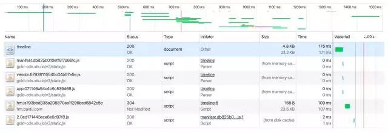
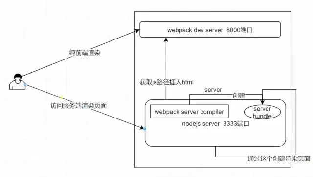
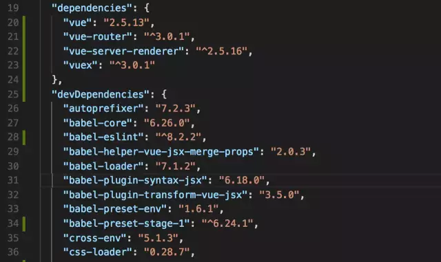
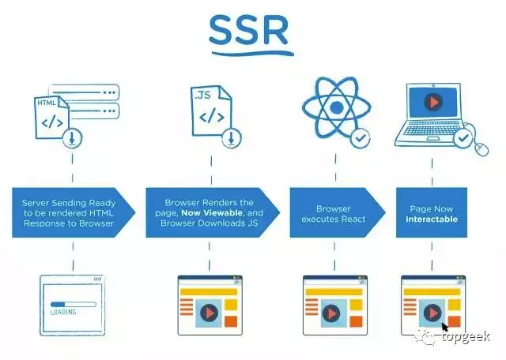
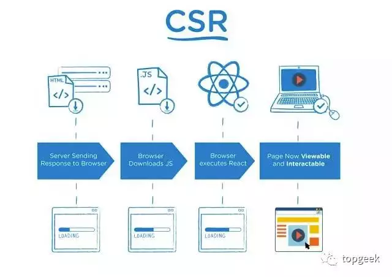
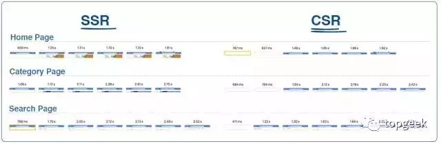
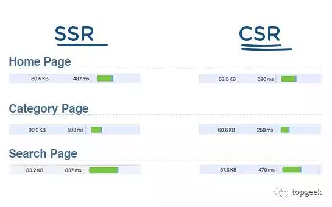

## 服务器端渲染定义


服务器端渲染 Server-Side Rendering 也常被人写作 SSR 是 Vue.js 2.0 版本发布的时候同时推出的功能，Virtual-DOM 的实现让 DOM 生成被 JavaScript 来描述也就给了前后端在 JavaScript 环境下都可以生成页面内容，而其最主要的业务 **vue-server-renderer**也包含在了 Vue.js核心库中。


## 为什么选择SSR


1. **SEO**：除了 Google 和 Bing 比较完美地实现了对于 SPA（Single-Page Application）的爬虫渲染及内容抓取，大多数搜索引擎包括百度都没有支持。因而，包含丰富内容的产品并需要 SEO 流量的产品也就自然需要 SSR 实现。


2. **加载速度**：Faster Time-to-Content
   


当网站是 SPA 时，渲染网站需要：第一次加载 HTML、加载 JavaScript、加载相应页面需要的 Vue Components（为了性能大多数组建都是异步取的）、渲染 DOM、加载数据、渲染 DOM、展示 … 而后端提前渲染好页面，可以快速展示到页面内容（其实加载数据部分的时间成本是省不下来的），因而还包含了使用缓存、renderToStream 等等优化速度的方法。

## 服务端渲染的流程




在使用服务端渲染的时候，首先要有个**server端**。因为在开发vue项目时，需要起一个webpack-dev-server的服务，端口8000。因为我们要使用它的热更替，这样能加快开发效率。

由于webpack是一个自主的server，我们没有办法在里面添加服务端渲染的代码，而这段代码是需要自己去写的，所以需要再起一个**node server**，去执行服务端渲染的逻辑。


我们会用到**vue-server-rendere**r这个包来帮我们在node.js环境里面去渲染出vue代码生成的HTML代码，这部分代码是直接返回给用户的，用户可以在浏览器里直接看到HTML的内容。


以图为例，我们看到两个渲染的过程，两种server。**如果直接访问webpack-dev-server，就跟我们之前开发的过程一样，它是一个纯前端渲染的过程。如果我们要走服务端渲染的流程，就要走node server服务，端口3333以示区别。**


而且需要打包一个逻辑到node端运行，通过**webpack-server-compiler**去生成一个server bundle，也就是服务端的**app.js**。当node server 获取到server bundle之后，就可以执行vue-server-renderer，去渲染出HTML的代码，直接返回给用户，这样的话就不需要通过js再去渲染出页面内容，减少了用户的等待时间。

## 如何编写服务器端渲染的配置文件？

首先我们需要在项目根目录里面找到build文件夹，然后在其下面新建一个webpack.config.server.js文件，具体配置代码：

```
const path = require('path')
const ExtractPlugin = require('extract-text-webpack-plugin')
const webpack = require('webpack')
const merge = require('webpack-merge')
const baseConfig = require('./webpack.config.base')
const VueServerPlugin = require('vue-server-renderer/server-plugin')
let config
config = merge(baseConfig, {
  target: 'node',
  entry: path.join(__dirname, '../client/server-entry.js'),
  devtool: 'source-map',
  output: {
    libraryTarget: 'commonjs2',
    filename: 'server-entry.js',
    path: path.join(__dirname, '../server-build')
  },
  externals: Object.keys(require('../package.json').dependencies),
module: {
    rules: [
      {
        test: /\.styl/,
        use: ExtractPlugin.extract({
          fallback: 'vue-style-loader',
          use: [
'css-loader',
            {
              loader: 'postcss-loader',
              options: {
                sourceMap: true
              }
            },
'stylus-loader'
          ]
        })
      }
    ]
  },
  plugins: [
new ExtractPlugin('styles.[contentHash:8].css'),
new webpack.DefinePlugin({
'process.env.NODE_ENV': JSON.stringify(process.env.NODE_ENV || 'development'),
'process.env.VUE_ENV': '"server"'
    }),
new VueServerPlugin()
  ]
})
module.exports = config
```


刚接触SSR的童鞋，不要晕，我来带大家一一分析下。


```
target: 'node',
```

target需要指定为**node**，因为打包出来的程序是在node端运行的，不是在浏览器端运行，所以要指定打包的目标是node环境。


```
entry: path.join(__dirname, '../client/server-entry.js'),
```

entry需要提供一个单独的入口文件，所以需要在client文件夹下新建一个**server-entry.js**文件。

```
devtool: 'source-map',
```

devtool需要指定source-map，因为vue-server-renderer有个webpack插件，它能提供代码调试的功能，不过只能提示到出错的文件出在哪一行。

```
libraryTarget: 'commonjs2',
```

指定libraryTarget的类型为**commonjs2**，用来指定代码export出去的入口的形式。在node.js中模块是module.exports = {...}，commonjs2打包出来的代码出口形式就类似于此。

```
externals: Object.keys(require('../package.json').dependencies),
```


externals是外部因素的意思，首先我们可以打开package.json文件看看dependencies





我们用Object.keys()得到的就是一个数组。externals就是告诉webpack不要去打包node_modules里面的js代码。


**devDependencies**里面是一些工具型的东西，在应用真正跑起来的时候是不需要的。只有在执行一些打包，工具化操作的时候才会需要它。


```
'process.env.VUE_ENV': '"server"'
```


这是vue服务端官方建议我们这么去做的，在vue-server-renderer里面可能会用到这个属性。


```
const VueServerPlugin = require('vue-server-renderer/server-plugin')
```


这个插件能帮我们单独地生成一个json文件，用于在vue的服务端渲染里面能帮助我们处理一些很复杂的逻辑。


**服务器端渲染和客户端渲染有何区别？**


首先我们将通过下面这份简单的时间线图展示SSR与CSR（即客户端渲染）之间的区别。 







可以看到其中最大的区别在于，**在使用SSR的情况下服务器对浏览器的响应结果属于已做好准备并可进行渲染的页面HTML，而CSR的浏览器响应结果则属于链接至JavaScript的空文档。**这意味着浏览器将立足服务器进行**HTML**渲染，而无需等待全部JavaSciprt代码的下载与执行。


在这两种情况下，我们都需要下载React并利用同样的流程构建一个虚拟dom，而后附加各事件以实现页面交互——但在SSR方面，用户可在执行上述流程的同时查看到页面内容。而在CSR方面，大家则需要等待上述流程全部执行完成，而后方可进行查看。


**注意事项**


1.尽管在SSR方面，页面会提前进行渲染以帮助客户更早查看页面内容，但**在React真正执行完成之后，查看到的内容并无法进行交互。**如果客户在此期间点击某按钮，该操作亦需要等待React执行完成后方可起效;


2.**SSR TTFB（即第一字节时间）速度比CSR更慢，**因为服务器需要耗费时间为页面创建HTML，而非直接发送相对较空的响应内容;


3.SSR的服务器数据吞吐量要远低于CSR数据通量。以React为例，这种数据吞吐量的差异将造成显著区别。


**ReactDOMServer.renderToString**为一项同步CPU绑定调用，其中包含该事件循环，意味着服务器将无法在


4.ReactDOMServer.renderToString完成之前处理其它请求。这里我们假定页面需要500毫秒进行SSR，则意味着每秒至多只能执行2项请求。


**实际案例**

在下图当中，我们就walmart.com网站上的各生产应用对SSR与CSR进行渲染效果比对。




我们将三款应用（即主页、分类与搜索）分别立足SSR与CSR方式进行比较。相关结果来自Chrome浏览器所捕捉到的页面渲染时间指标。
 
大家可能已经注意到，**SSR渲染速度要更快一些，而使用CSR则意味着加载过程中浏览器内将显示空白页面。**大多数使用CSR的应用都会利用加载图标来取代这种难看的空白页面，但由于我们在正常操作中默认使用SSR，因此在CSR测试中页面仍保持未经发动的空白样式。


需要注意的是，上述结果皆为我们的设备在一天中特定时段内配合实际生产配置捕捉到的结果，因此经过定制化调整的方案也许在性能上有所区别——不过总体而言，其仍然足以反映**一般性趋势**。




上图为主页、分类与搜索页面的首次服务器响应对比。在这里忽略掉了绿色指标条，因为其更多反映的是网络图中的其它元素。这里最值得关注的其实是**文档大小与TTFB**。
 
由于服务器会利用HTML对页面进行响应，因此大家可以看到SSR的文档总是相对较大。另外需要强调的是，正如前文中所提到，**CSR响应速度更快**（除了主页，这是因为受到本次测试中某些因素的影响）。

上述测量指标会随着应用类型、延迟、服务器、位置以及多种其它变量的变化而有所浮动，因此请不要将其视为科学的客观事实——而仅用于反映一种普遍规律。
 
**Electrode框架**

在我们对SSR与CSR进行A/B测试时，得出了以上总体趋势，而我们的数字也显示尽早进行渲染往往能够带来更理想的操作体验。

考虑到这些理由，开源应用平台Electrode高度关注SSR。其默认启用SSR，而我们亦构建起多种模块以进一步提升SSR性能表现。


**【学习目标】**


-掌握SPA类应用开发过程如何应对**SEO**需求； 

-掌握目前市面上主流的Web应用页面渲染模式； 

-掌握**React**同构开发框架Next.js的使用； 

-掌握**Vue.js**同构开发框架Nuxt.js的使用； 

-了解前端应用如何实现自动化部署以及常见的**CI**工具；


**【SSR大纲】**


**Day 01 -服务端渲染（SSR）与同构开发**

-纵观所有Web应用的前端渲染方式

-SPA应用的SEO问题

-五大页面渲染方式之间的对比

（后端模板渲染、客户端渲染、Node.js中间层、服务器端渲染、 服务端预渲染（静态页面生成））

-React/Vue.js中实现SSR与同构开发

-服务端渲染的实现原理剖析


**Day 02 - React 服务端渲染与 Next.js**

-React 配合 Express 实现 SSR

-Nextjs构建博客应用实战

-Next.js常用插件

-ZEIT Now PaaS部署应用


**Day 03 - Vue.js 服务端渲染与 Nuxt.js**

-Vue.js 配合 Express 实现 SSR

-Nuxt.js构建Hackernews应用实战

-Nuxt.js的静态导出

-GitHub Actions CI
