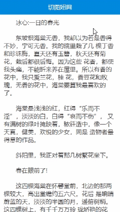

### 题目：CSS经典布局-Sticky-Footer(footer高度不固定)


**前言**
    Sticky Footer是css的一种布局场景。页脚footer永远固定在页面的底部，页面内容不够长的时候页脚黏在视窗底部，内容足够长时会被向下移动。老式门户网站由于内容过短常常版权页脚前移，移动端特定布局也需要Sticky Footer来解决这些问题。

    

### 1.利用绝对定位和padding完美兼容

**已知底部高度，利用绝对定位和padding完美兼容**

去除标签多余的margin,padding,给html和body设置100%。
外部容器min-height为100%，使得内容少时也能撑开。
主体内容设置padding-bottom，这个为底部的高度，可以使内容完全显示否则会使主体内容有底部面积大小区域被遮挡
footer高度固定，进行绝对定位。

**DOM节点**


```
<div class="container">
  <div class="header"></div>
  <div class="section">
  </div>
  <div class="footer">Copyright© 1994-2019 切图妞</div>
</div>
```


**样式代码**


```
html,
body {
  height: 100%;
}
.container {
  position: relative;
  min-height: 100%;
  height: auto !important;
  height: 100%; /*IE6不识别min-height*/
}
.section {
  padding-bottom: 60px;
}
.footer {
  position: absolute;
  width: 100%;
  height: 60px;
  bottom: 0px;
}
```
### 2.利用padding-bottom和margin-top完美兼容

**已知底部高度，利用padding-bottom和margin-top完美兼容**

去除标签多余的margin,padding,给html和body设置100%；
外部容器min-height为100%，使得内容少时也能撑开
主体内容设置padding-bottom，这个为底部的高度
footer高度固定，margin-top的值为高度负值


DOM节点

```
<div class="container">
      <div class="header">二、利用padding-bottom和margin-top完美兼容</div>
      <div class="section">
        <p>已知底部高度，利用padding-bottom和margin-top完美兼容</p>
        <p>1、去除标签多余的margin,padding,给html和body设置100%；</p>
        <p>2、外部容器min-height为100%，使得内容少时也能撑开</p>
        <p>3、主体内容设置padding-bottom，这个为底部的高度</p>
        <p>4、footer高度固定，margin-top的值为高度负值</p>  
      </div>
    </div>
    <div class="footer">Copyright© 1994-2019 切图妞</div>
```

样式代码


```
/* 基础样式 */
* {
  padding: 0;
  margin: 0;
}
.header {
  background-color: #08d;
  color: #fff;
  line-height: 40px;
  text-align: center;
}
.section {
  color: #333;
}
p{
  margin: 10px;
}
.footer {
  background-color: #08d;
  color: #fff;
  text-align: center;
}
/* 实现样式 */
html,
body {
  height: 100%;
}
.container {
  min-height: 100%;
  height: auto !important;
  height: 100%; /*IE6不识别min-height*/
}
.section {
  padding-bottom: 60px;
}
.footer {
  position: relative;
  margin-top: -60px;
  width: 100%;
  height: 60px;
}
```

### 三、新增块级元素填补页脚遮挡

**已知底部高度，新增块级元素填补页脚遮挡，实现完美兼容**

去除标签多余的margin,padding,给html和body设置100%；
外部容器min-height为100%，使得内容少时也能撑开
主体内容设置margin-bottom，值为底部的高度的负值
footer位置在与container同级，section同级新增块元素.底部和新增块元素高度一致


DOM节点

```
<div class="container">
  <div class="header">三、新增块级元素填补页脚遮挡</div>
  <div class="section">
    <p>已知底部高度，新增块级元素填补页脚遮挡，实现完美兼容</p>
    <p>1、去除标签多余的margin,padding,给html和body设置100%；</p>
    <p>2、外部容器min-height为100%，使得内容少时也能撑开</p>
    <p>3、主体内容设置margin-bottom，值为底部的高度的负值</p>
    <p>4、footer位置在与container同级，section同级新增块元素.底部和新增块元素高度一致</p>
  </div>
  <div class="placeholder"></div>
</div>
<div class="footer">Footer Section</div>
```


样式代码

```
/* 基础样式 */
* {
  padding: 0;
  margin: 0;
}
.header {
  background-color: #08d;
  color: #fff;
  line-height: 40px;
  text-align: center;
}
.section {
  color: #333;
}
p{
  padding: 10px;
}
.footer {
  background-color: #08d;
  color: #fff;
  text-align: center;
}
/* 实现样式 */
html,
body {
  height: 100%;
}
.container {
  min-height: 100%;
  height: auto !important;
  height: 100%; /*IE6不识别min-height*/
  margin-bottom: -60px;
}
.placeholder,
.footer {
  height: 60px;
}
```

### 四、用表格属性实现完美兼容

**底部不定高度，利用表格属性实现完美兼容**

去除标签多余的margin,padding,给html和body设置100%
外部容器min-height为100%;使得内容少时也能撑开，display属性设置为table
主体内容display属性设置为table-row，高度设置为100%

DOM节点
```
<div class="container">
  <div class="header">四、利用表格属性实现完美兼容</div>
  <div class="section">
    <p>底部不定高度，利用表格属性实现完美兼容</p>
    <p>1、去除标签多余的margin,padding,给html和body设置100%；</p>
    <p>2、外部容器min-height为100%;使得内容少时也能撑开，display属性设置为table</p>
    <p>3、主体内容display属性设置为table-row，高度设置为100%</p>
  </div>
  <div class="footer">Copyright© 1994-2019 切图妞</div>
</div>
```

样式代码

```
/* 基础样式 */
* {
  padding: 0;
  margin: 0;
}
.header {
  background-color: #08d;
  color: #fff;
  line-height: 40px;
  text-align: center;
}
.section {
  color: #333;
}
p{
  margin: 10px;
}
.footer {
  background-color: #08d;
  color: #fff;
  text-align: center;
}
/* 实现样式 */
html,
body {
  height: 100%;
}
.container {
  display: table;
  width: 100%;
  min-height: 100%;
}
.section {
  display: table-row;
  height: 100%;
}
```

### 五、calc计算


**vh存在兼容有限，一般在移动端使用。100vh可代替body和html的100%来拿到视口高度实现效果**

外部容器使用calc计算，100vh减去底部高度
footer位置与container同级，高度固定
主体内容display属性设置为table-row，高度设置为100%


DOM节点


```
<div class="container">
      <div class="header">五、calc计算</div>
      <div class="section">
        <p>vh存在兼容有限，一般在移动端使用。100vh可代替body和html的100%来拿到视口高度</p>
        <p>1、外部容器使用calc计算，100vh减去底部高度</p>
        <p>2、footer位置与container同级，高度固定</p>  
      </div>
    </div>
    <div class="footer">Copyright© 1994-2019 切图妞</div>
```


样式代码

```
/* 基础样式 */
* {
  padding: 0;
  margin: 0;
}
.header {
  background-color: #08d;
  color: #fff;
  line-height: 40px;
  text-align: center;
}
.section {
  color: #333;
}
p{
  padding: 10px;
}
.footer {
  background-color: #08d;
  color: #fff;
  text-align: center;
}
/* 实现样式 */
.container {
  min-height: calc(100vh - 60px);
}
.footer {
  height: 60px;
}
```

### 六、flex弹性布局

**底部不定高度，利用flex弹性布局实现效果，兼容性有限建议移动端使用**


外部容器display设为flex弹性布局，flex-flow设置方向为column纵向并设置最小高度为100vh
主体内容flex属性设为1


DOM节点

```
<div class="container">
  <div class="header">六、flex弹性布局</div>
  <div class="section">
    <p>底部不定高度，利用flex实现效果,兼容性有限建议移动端使用</p>
    <p>1、外部容器display设为flex弹性布局，flex-flow设置方向为column纵向并设置最小高度为100vh</p>
    <p>2、主体内容flex属性设为1</p>
  </div>
  <div class="footer">Footer Section</div>
</div>
```


样式代码

```
/* 基础样式 */
* {
  padding: 0;
  margin: 0;
}
.header {
  background-color: #08d;
  color: #fff;
  line-height: 40px;
  text-align: center;
}
.section {
  color: #333;
}
p{
  margin: 10px;
}
.footer {
  background-color: #08d;
  color: #fff;
  text-align: center;
}
/* 实现样式 */
.container {
  display: flex;
  flex-flow: column;
  min-height: 100vh;
}
.section {
  flex: 1
}
```


### 七、Grid网格布局


**底部不定高度，利用Grid网格实现效果，兼容性有限建议移动端使用**

外部容器display设为grid网格布局，grid-template-rows设置一个网格的行，fr单位可以帮助我们创建一个弹列的网格轨道,它代表了网格容器中可用的空间（就像Flexbox中无单位的值）
header头部的位置放在主体内容内部
footer中grid-row-start和grid-row-end属性设置单元格开始和结束的行线


DOM节点

```
<div class="container">
  <div class="section">
    <div class="header">七、Grid网格布局</div>
    <p>底部不定高度，利用Grid网格实现效果，兼容性有限建议移动端使用</p>
    <p>
      1、外部容器display设为grid网格布局，grid-template-rows设置一个网格的行，fr单位可以帮助我们创建一个弹列的网格轨道,它代表了网格容器中可用的空间（就像Flexbox中无单位的值）
    </p>
    <p>2、header头部的位置放在主体内容内部</p>
    <p>
      3、footer中grid-row-start和grid-row-end属性设置单元格开始和结束的行线
    </p>
  </div>

  <div class="footer">Copyright© 1994-2019 切图妞</div>
</div>
```

样式代码
```
/* 基础样式 */
* {
  padding: 0;
  margin: 0;
}
.header {
  background-color: #08d;
  color: #fff;
  line-height: 40px;
  text-align: center;
}
.section {
  color: #333;
}
p{
  margin: 10px;
}
.footer {
  background-color: #08d;
  color: #fff;
  text-align: center;
}
/* 实现样式 */
.container {
  min-height: 100vh;
  display: grid;
  grid-template-rows: 1fr auto;
}
.footer {
  grid-row-start: 2;
  grid-row-end: 3;
}
```

## 结语  

以上方法各有优劣，根据使用场景选择合适的方案

| 场景 | 方案 |
| :----|:----|
|兼容性要求高|①②③|
|底部不固定高度|④⑥⑤⑦|
|PC端建议|①②|
|移动端建议|①②⑥|


完整代码
来自：https://segmentfault.com/a/1190000018961782
	
	
	
	